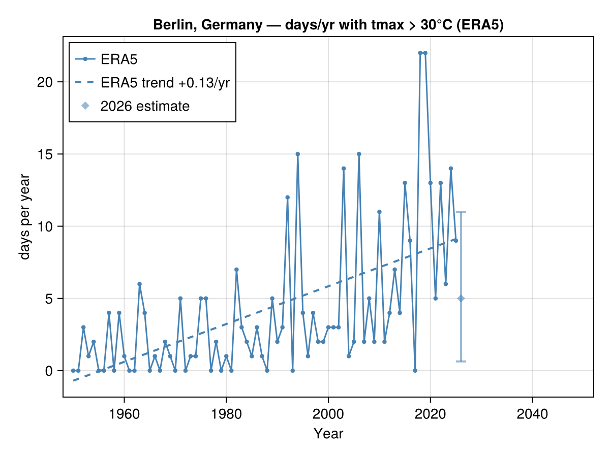

# ClimStats

A Julia package that provides an API for retrieving climate data for a single
location and calculating things from it — starting with **ERA5 reanalysis** (the
past) and growing toward **CMIP6 climate projections** (the future).

The headline goal: write a place name like `"Berlin, Germany"` and get back the
data *and* a figure — e.g. a time series of the number of days per year above
30 °C.

```julia
using ClimStats
using CairoMakie        # a Makie backend (see "Plotting backends" below)

fig = climate_timeseries("Berlin, Germany"; threshold = 30)
save("berlin_hot_days.png", fig)        # `save` is re-exported from Makie
```


Figures are built with [Makie](https://docs.makie.org) **core**, so you choose
the backend: `CairoMakie` for publication-quality files, `GLMakie`/`WGLMakie`
for interactive windows (and, later, dashboards). See
[Plotting backends](#plotting-backends).

## Installation

```julia
using Pkg
Pkg.develop(path = ".")   # from a clone of this repo
# or, once it lives on GitHub:
# Pkg.add(url = "https://github.com/alex-robinson/climstats")
```

Then `instantiate` to pull the dependencies (DataFrames, HTTP, JSON3, Makie).
You'll also want a Makie **backend** for rendering — `Pkg.add("CairoMakie")`:

```julia
Pkg.activate(".")
Pkg.instantiate()
```

## Quick start

The package is designed so that one download lets you compute many things.

```julia
using ClimStats, Dates

# Resolve a place to coordinates.
loc = geocode("Berlin, Germany")          # Location(Berlin, Germany @ 52.52°N, 13.41°E)

# Download daily ERA5 (tmax / tmin / tmean / precip) for that point.
data = era5_daily(loc; start = Date(1950,1,1))

# Compute indices — each returns a tidy DataFrame of one value per year.
hot     = days_above(data, 30)            # days/yr with Tmax > 30 °C
frost   = frost_days(data)                # days/yr with Tmin < 0 °C
tropics = tropical_nights(data)           # days/yr with Tmin > 20 °C
warming = annual_mean(data; var = :tmean) # yearly mean temperature
rainfall = annual_sum(data; var = :precip)# yearly total precipitation

# Plot any of them (a dashed least-squares trend line is added automatically).
plot_index(hot; ylabel = "days per year",
           title = "Hot days in Berlin (ERA5)")
```

### The variables you get

`era5_daily` returns a `ClimateData` whose `.table` is a daily `DataFrame` with:

| column   | meaning                          | units |
|----------|----------------------------------|-------|
| `:date`  | calendar day                     | `Date`|
| `:tmax`  | daily maximum 2 m temperature    | °C    |
| `:tmin`  | daily minimum 2 m temperature    | °C    |
| `:tmean` | daily mean 2 m temperature       | °C    |
| `:precip`| daily total precipitation        | mm    |

That's enough to build a great many indices. Provided out of the box:

- `days_above(data, T; var)` / `days_below(data, T; var)` — generic day counts
- `annual_count(data, predicate; var)` — count days matching any predicate
- `annual_mean(data; var)` / `annual_sum(data; var)` — continuous annual stats
- Named ETCCDI-style helpers: `hot_days`, `summer_days`, `frost_days`,
  `icing_days`, `tropical_nights`, `wet_days`
- `linear_trend(years, values)` — OLS slope/intercept for any series

## How it works (data sources)

This first version uses the free, **no-API-key** [Open-Meteo](https://open-meteo.com)
HTTP APIs, which serve point time series directly (no need to download and crop
gridded files):

| Need                | Endpoint                            | Product            |
|---------------------|-------------------------------------|--------------------|
| place → coordinates | `geocoding-api.open-meteo.com`      | —                  |
| past (ERA5)         | `archive-api.open-meteo.com`        | ERA5 / ERA5-Land   |
| future (CMIP6)      | `climate-api.open-meteo.com`        | CMIP6 (downscaled) |

> **Network access is required for the *first* fetch of a location.** Data are
> fetched live, then cached on disk so the same series is not downloaded again —
> see [Caching](#caching-fetch-once-reuse-everywhere).

### Why not the Copernicus CDS directly?

Native ERA5 from the Copernicus Climate Data Store requires an account, an API
key, accepting a licence, and downloading large gridded NetCDF/GRIB files that
you then crop to a point. For "give me one location's daily series" that is a lot
of overhead. ClimStats therefore starts with Open-Meteo's ERA5 archive, but the
provider layer is deliberately thin and isolated (`src/providers.jl`): a future
CDS-backed downloader only has to return a `ClimateData` using the same column
convention, and every index/plot helper keeps working unchanged.

## Caching (fetch once, reuse everywhere)

Downloads are the slow, rate-limited part, so ClimStats caches both the data it
fetches **and** the expensive things it derives. Caching is on by default, fully
transparent, and persists across sessions — the second run of a location is
served from disk. It is built on [DataManifest.jl](https://github.com/awi-esc/DataManifest.jl)'s
content-addressed `@cached` store (see [`src/cache.jl`](src/cache.jl)).

What gets cached, and how it is keyed:

| layer                     | function(s)                                   | keyed by |
|---------------------------|-----------------------------------------------|----------|
| ERA5 point series         | `era5_daily`                                  | snapped cell + stable month |
| NEX-GDDP point series     | `nexgddp_daily`                               | snapped cell + model/scenario/variant/grid/variable |
| bias-corrected series     | `bias_correct`                                | content of both inputs + fit parameters |
| nowcast analog completions| `complete_current_year`, `estimate_current_year` | content of `data` + analog settings |

Two conventions make the cache *reusable* rather than per-request:

- **Coordinates snap to the 0.25° source grid.** Nearby queries (or the same
  place geocoded twice with float noise) resolve to one cached download.
- **One fetch serves many queries.** ERA5 stores the full history `[1950 … last
  complete month]` once per cell — any later call at *any* date range or variable
  subset is sliced from it. Only the recent, still-changing tail is fetched live;
  that stable cache rolls forward once a month, which is also when finalised ERA5
  replaces the preliminary ERA5T edge. NEX-GDDP is a fixed archive, so its full
  1950–2100 span is cached once per cell and never re-read.
- **Derived results skip recompute, not just re-download.** Bias-correction fits
  and the nowcast's analog resampling are cached as their *index-independent*
  intermediates, so running ten different indices over one location recomputes
  nothing.

Every entry is a portable Arrow file (readable from Python/JS too), under the
per-project user cache dir (`~/Library/Caches/datamanifest/…` on macOS,
`$XDG_CACHE_HOME/datamanifest/…` on Linux). Pass `cache = false` to any of the
functions above to force a fresh computation:

```julia
era5_daily("Berlin, Germany"; cache = false)            # ignore the cache
bias_correct(model, hist; method = :qdm, cache = false)
```

For a deployed dashboard, point DataManifest's `datacache_dir` at a shared,
persistent volume so every instance reuses one cache.

## Projections: past + future on one figure

The projections step is implemented. `climate_projection` geocodes the place,
downloads ERA5 history *and* a multi-model CMIP6 ensemble (to 2050),
bias-corrects each model against the ERA5 baseline, and draws the index for both
on one set of axes — the ensemble as a median line with a shaded spread band:

```julia
fig = climate_projection("Berlin, Germany"; threshold = 30)
save("berlin_hot_days_projection.png", fig)
```


It composes from three reusable pieces, so you can drive each stage yourself:

```julia
hist = era5_daily("Berlin, Germany")

# 1. Multi-model ensemble (one member per model, failures skipped with a warning).
ens = projection_ensemble("Berlin, Germany")          # -> Ensemble

# 2. Bias-correct every member against the ERA5 baseline (1991–2020 by default).
ens = bias_correct(ens, hist)                         # per-month delta correction

# 3. Summarise the spread of any index across the ensemble.
summary = ensemble_index(ens, d -> days_above(d, 30)) # year, lo, median, hi, mean, n

fig = plot_index(days_above(hist, 30); label = "ERA5", trend = false)
plot_ensemble!(fig, summary; label = "CMIP6 (bias-corr.)")
```

Any index works in `climate_projection` via the `index` keyword, e.g. mean
warming instead of hot-day counts:

```julia
climate_projection("Berlin, Germany"; index = d -> annual_mean(d; var = :tmean))
```

### How the bias correction works

Models carry systematic biases relative to reanalysis, so raw model values can't
feed absolute-threshold indices directly. ClimStats corrects each model towards
ERA5 over a reference period (default the 1991–2020 WMO normal), per calendar
month, with a choice of method (`fit_bias_correction` / `apply_bias_correction` /
`bias_correct`, or the `method` keyword to `climate_projection`):

| `method`  | what it does                                                        |
|-----------|---------------------------------------------------------------------|
| `:qdm`    | **Quantile Delta Mapping** (default) — matches the whole distribution to ERA5 *and* preserves the model's projected change at each quantile (Cannon et al. 2015). Best for projections. |
| `:eqm`    | Empirical Quantile Mapping — matches the distribution to ERA5 by CDF. |
| `:delta`  | Per-month mean shift only — fast, corrects the mean but not the distribution shape. |

All methods are **additive** for temperatures and **multiplicative** for
precipitation. Quantile mapping corrects not just the mean but the variance and
tails, which is what makes threshold indices (days > 30 °C, frost days, …)
trustworthy on model data.

```julia
bias_correct(model, hist; method = :qdm)   # or :eqm, :delta
climate_projection("Berlin, Germany"; method = :qdm)
```

## The current year: a nowcast estimate

ERA5 lags real time by about a week, so the **current calendar year is always
incomplete**. A hot-day count or precipitation total computed on it is a
misleading lower bound (the summer may not have happened yet); an annual mean is
seasonally biased. Rather than plot that partial value, ClimStats *completes* the
year and shows a statistical estimate with an uncertainty band.

By default `climate_timeseries` and `climate_projection` drop the trailing
partial year from the solid history and overlay it as a lighter diamond with a
lo–hi error bar:

```julia
fig = climate_timeseries("Berlin, Germany"; threshold = 30)   # nowcast = true by default
```



The same estimate appears on the combined past+future figure (run
[`examples/berlin_nowcast.jl`](examples/berlin_nowcast.jl) to render it):

```julia
fig = climate_projection("Berlin, Germany"; threshold = 30)   # ERA5 + CMIP6, to 2050
```

**How the estimate is built** — analog resampling (`src/nowcast.jl`):

1. Compare the current year's observed window (Jan 1 → last available day)
   against the *same calendar window* of every complete prior year, by RMSE of
   the daily variable. Closer years are better analogs.
2. Turn those distances into weights with a Gaussian kernel (optionally keeping
   only the top-K analogs).
3. For each analog year, take its remaining days as a candidate trajectory for
   the rest of *this* year — **anchored** by shifting it so its window mean
   matches the current year's (additive for temperatures, multiplicative for
   precip). This tracks how the year is actually running and preserves the
   day-to-day structure within an analog.
4. Each anchored analog yields a *completed* daily series; running an index over
   the weighted members gives the median and lo–hi band that are plotted.

You can call the estimator directly for any index:

```julia
data = era5_daily("Berlin, Germany")
est  = estimate_current_year(data, d -> days_above(d, 30; var = :tmax); var = :tmax)
# CurrentYearEstimate(2026: 5 [1–11], 165/365 days, 20 analogs)  (illustrative)

est.median, est.lo, est.hi      # the estimate and its band
est.observed_partial            # the (lower-bound) count from observed days only
```

`complete_current_year(data)` returns the completed daily members themselves —
each an ordinary `ClimateData` with a Boolean `:estimated` column (`false` for
observed days, `true` for analog-filled days), so the synthetic tail never
silently mixes with observations. Pass `nowcast = false` to either plot helper
to fall back to the raw partial value.

## SSP scenarios (NEX-GDDP-CMIP6)

Open-Meteo's CMIP6 ensemble follows a single fixed pathway, so for
scenario-aware projections ClimStats adds a **NASA NEX-GDDP-CMIP6** backend:
daily, statistically downscaled (0.25°) CMIP6 covering historical (1950–2014)
and the four SSPs — `:ssp126`, `:ssp245`, `:ssp370`, `:ssp585` — to 2100.

It reads point time series over OPeNDAP, so it needs the NetCDF stack. That is
an **optional dependency**, enabled via a package extension — just load it:

```julia
using ClimStats
using NCDatasets        # enables the NEX-GDDP backend

# One model, one scenario (historical + SSP spliced into one daily series):
data = nexgddp_daily("Berlin, Germany"; model = "MPI-ESM1-2-HR", scenario = :ssp585)

# The headline SSP figure: ERA5 history + a bias-corrected ensemble per scenario.
fig = climate_ssp("Berlin, Germany"; threshold = 30,
                  scenarios = (:ssp126, :ssp245, :ssp585))
save("berlin_hot_days_ssp.png", fig)
```

`nexgddp_daily` returns the same [`ClimateData`](#) shape as `era5_daily`, so
indices, quantile-mapping bias correction and plotting all apply. `ssp_ensemble`
builds a multi-model `Ensemble` for one scenario; `climate_ssp` overlays one
shaded fan per SSP.

> **Download cost.** NEX-GDDP stores one file per model/scenario/variable/year,
> so a *cold* request fans out into many OPeNDAP reads. That cost is paid once:
> the full 1950–2100 span is [cached](#caching-fetch-once-reuse-everywhere) per
> cell/model/scenario/variable, and later calls (any sub-range) are served from
> disk. `climate_ssp` still defaults to a small model set
> (`NEXGDDP_DEFAULT_MODELS`) and fetches only the variable the index needs, so
> the first run stays manageable; widen `models`, `vars` and the year range as
> needed.
>
> Model realisation/grid labels vary; the registry (`nexgddp_model_spec`) covers
> common cases and falls back to `r1i1p1f1`/`gn`. Override per call with
> `variant`/`grid` if a model uses something else (unavailable files are skipped
> with a warning rather than aborting the ensemble).

## Plotting backends

ClimStats depends only on **Makie core** and builds backend-agnostic `Figure`s;
you bring the backend. Load one before rendering or saving:

| backend     | use for                                            |
|-------------|----------------------------------------------------|
| `CairoMakie`| static, publication-quality files (PNG/PDF/SVG)    |
| `GLMakie`   | fast interactive windows (zoom/pan, exploration)   |
| `WGLMakie`  | browser/notebook output — the basis for a dashboard|

```julia
using ClimStats
using CairoMakie                       # or GLMakie / WGLMakie

fig = climate_projection("Berlin, Germany"; threshold = 30)
save("berlin.png", fig)                # `save` needs a backend loaded
# display(fig)                         # interactive with GLMakie/WGLMakie
```

All plot helpers return a `Makie.Figure`, and the mutating ones (`plot_index!`,
`plot_ensemble!`) draw into its `Axis`, so figures compose and can be embedded in
a larger Makie layout — the intended path to an interactive dashboard later.

## Project layout

```
src/
  ClimStats.jl   # module, exports, includes
  types.jl       # Location, ClimateData
  cache.jl       # on-disk caching (DataManifest @cached): Arrow codec, grid snap, content hash
  providers.jl   # geocode + era5_daily + projection_daily (Open-Meteo)
  indices.jl     # days_above/below, annual_mean/sum, named indices, trend
  bias.jl        # bias correction (delta + quantile mapping) vs ERA5
  ensemble.jl    # multi-model ensembles + spread summaries
  nowcast.jl     # analog-year estimate for the incomplete current year
  plotting.jl    # plot_index, plot_ensemble!, plot_nowcast!, climate_timeseries/projection
  nexgddp.jl     # NEX-GDDP-CMIP6 / SSP logic + climate_ssp (pure parts)
ext/
  ClimStatsNCDatasetsExt.jl  # NetCDF/OPeNDAP reads (loaded by `using NCDatasets`)
examples/
  berlin.jl          # the headline ERA5 example end-to-end
  berlin_nowcast.jl  # current-year nowcast on history and projection figures
  berlin_ssp.jl      # SSP scenarios via NEX-GDDP-CMIP6
test/
  runtests.jl    # offline unit tests (+ optional live tests)
```

## Tests

The unit tests run **offline** (they exercise the index, parsing and plotting
logic on synthetic data):

```julia
using Pkg; Pkg.test()
```

To additionally run the live Open-Meteo tests:

```bash
CLIMSTATS_NETWORK_TESTS=true julia --project=. -e 'using Pkg; Pkg.test()'
```

## Status

Early days (`v0.1`). Complete: ERA5 retrieval, indices, plotting, multi-model
CMIP6 ensembles, combined past+future figures, bias adjustment against ERA5
(delta-change *and* quantile-mapping QDM/EQM), a current-year nowcast estimate
for the incomplete trailing year, SSP-scenario projections via the
NEX-GDDP-CMIP6 backend (`climate_ssp`), and transparent on-disk
[caching](#caching-fetch-once-reuse-everywhere) of fetched and derived data. The
live NEX-GDDP path is implemented against NASA NCCS OPeNDAP but, unlike the
offline-tested core, has not yet been exercised end-to-end here — try it and
report back.
