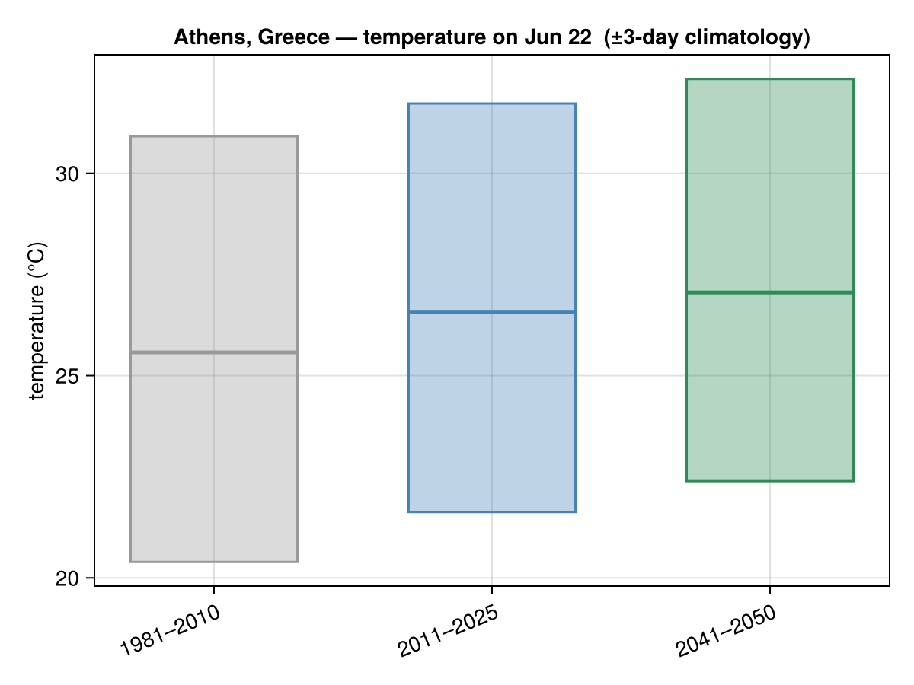
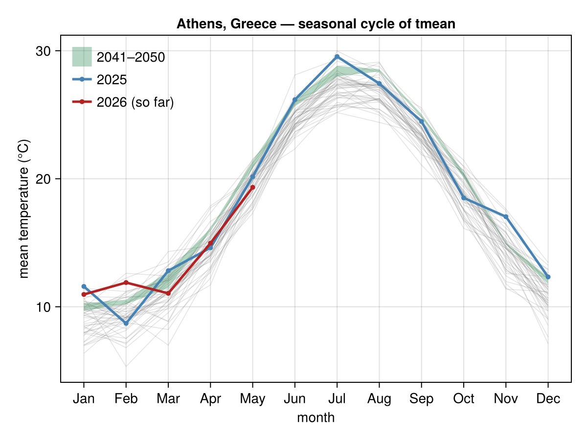
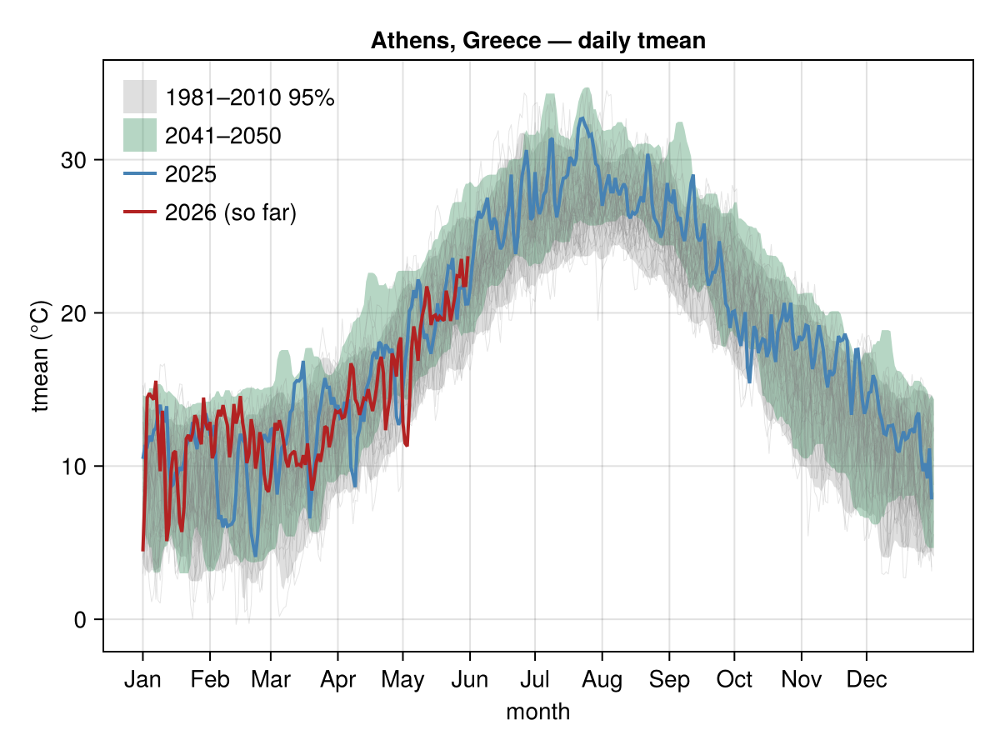

# Athens, Greece

Temperature climatology for **Athens, Greece**, from
[`climate_day_comparison`](@ref), [`climate_monthly`](@ref) and
[`climate_daily`](@ref). History is **NASA POWER** (1981→present).

!!! note "Partial CMIP6 ensemble"
    The future (2041–2050) band here is drawn from **2 of the 6** projection
    models currently cached for Athens, so its spread is narrower than it will be
    once the full ensemble is fetched. The figures will be refreshed when the
    remaining models are added (`scripts/generate_fixtures.jl` +
    `scripts/collect_fixtures.jl`, then `docs/make_city_figures.jl`).

These were rendered offline, so the day-of-year panel omits the live-forecast bar.

