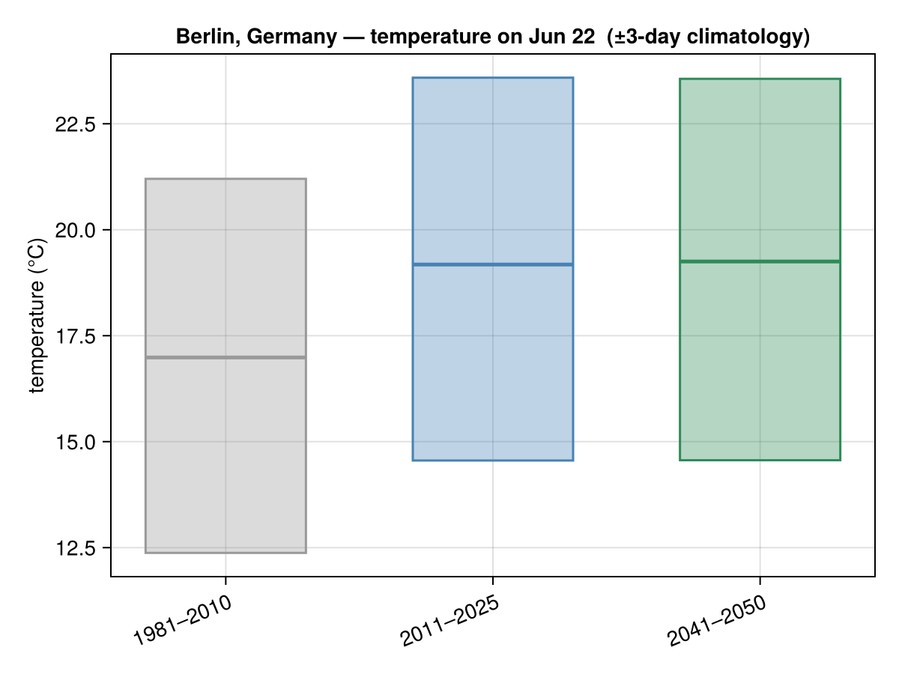
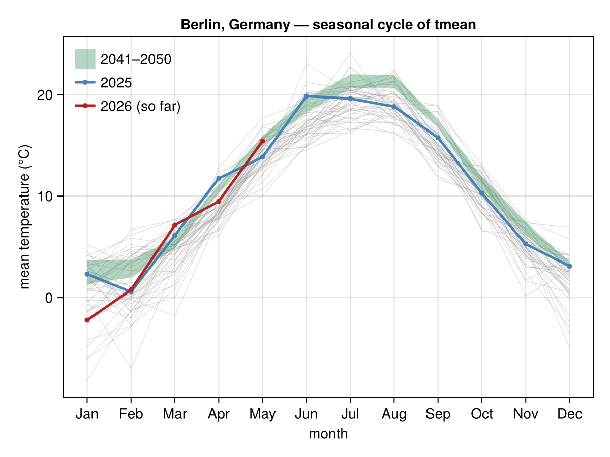
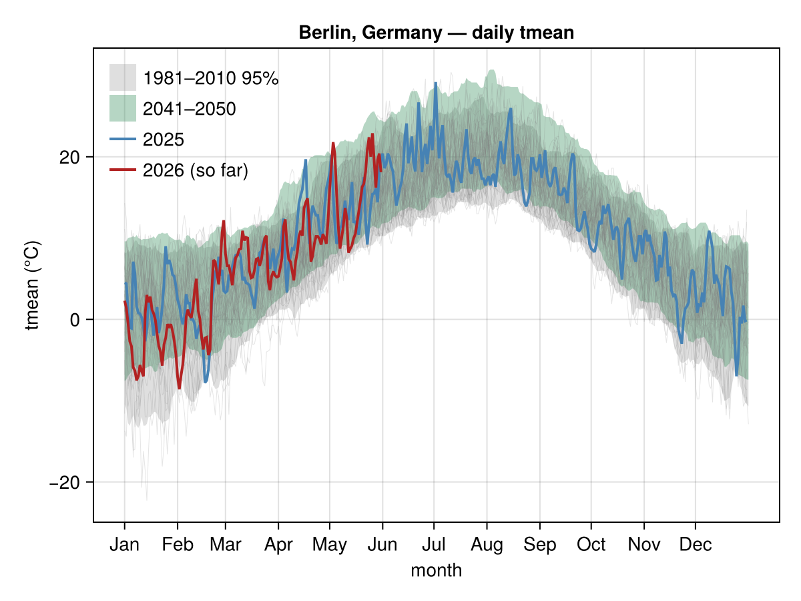

# Berlin, Germany

Temperature climatology for **Berlin, Germany**, from
[`climate_day_comparison`](@ref), [`climate_monthly`](@ref) and
[`climate_daily`](@ref). History is **NASA POWER** (1981→present, keyless and
quota-free); the future band is a bias-corrected CMIP6 ensemble for 2041–2050.
Berlin's series ship as a committed offline fixture (see [Caching](../caching.md)),
so these figures render with no network and no API quota.

```julia
using ClimStats, CairoMakie
save("berlin_today_vs_climate.png", climate_day_comparison("Berlin, Germany"))
save("berlin_monthly.png",          climate_monthly("Berlin, Germany"))
save("berlin_daily.png",            climate_daily("Berlin, Germany"; spaghetti = true))
```

The day-of-year panel adds today's live forecast (black bar) when run online.






