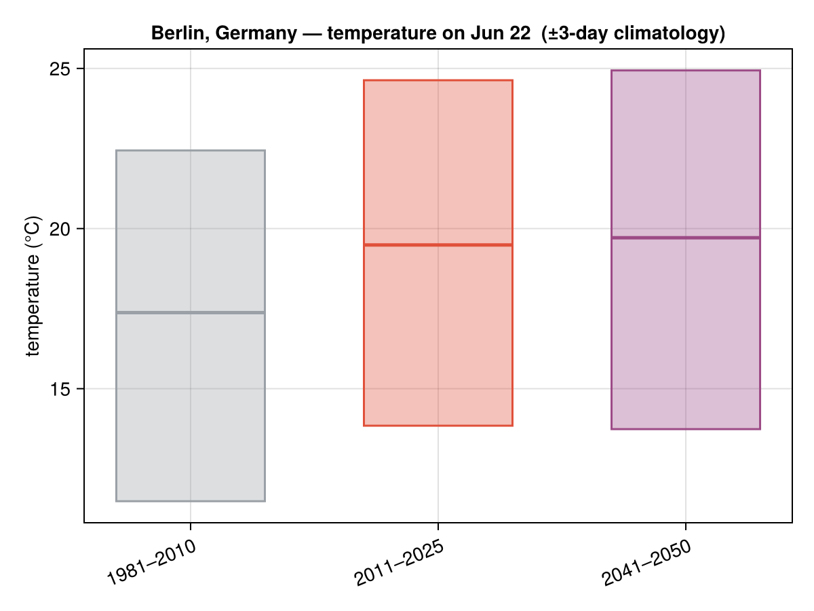
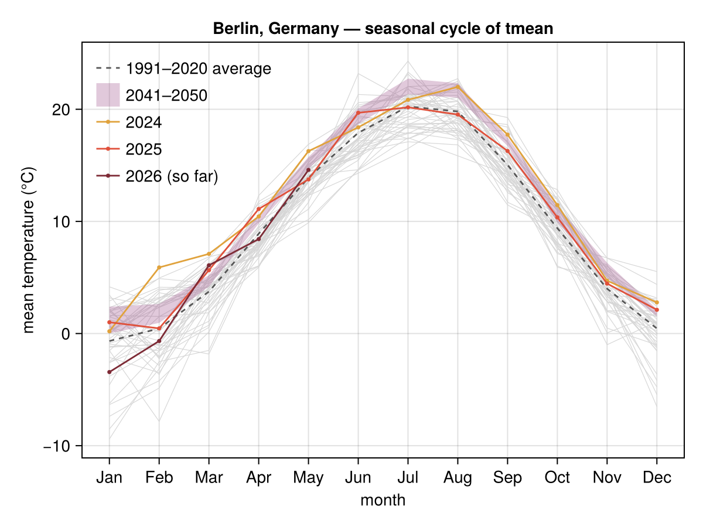
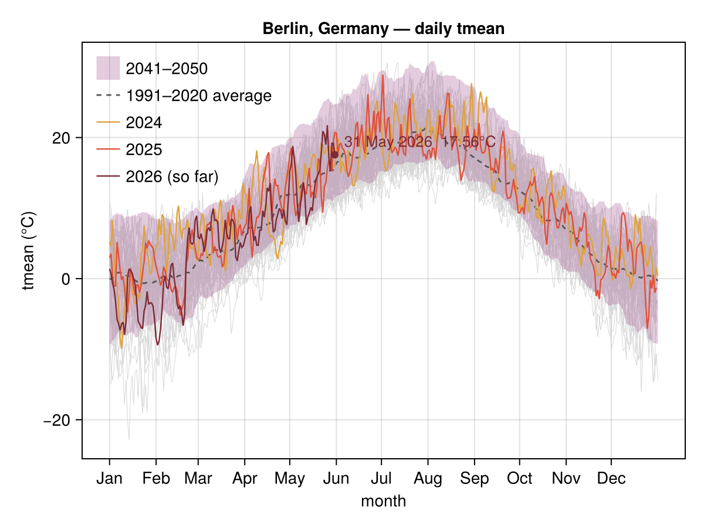

# Berlin, Germany

Temperature climatology for **Berlin, Germany** — from [`climate_day_comparison`](@ref), [`climate_monthly`](@ref) and [`climate_daily`](@ref). History is **NASA POWER** (1981→present, keyless and quota-free); the future band is a bias-corrected CMIP6 ensemble for 2041–2050. The series ship as a committed offline fixture (see [Caching](../caching.md)), so these figures render with no network and no quota. This page is generated by `docs/make_locations.jl`.

