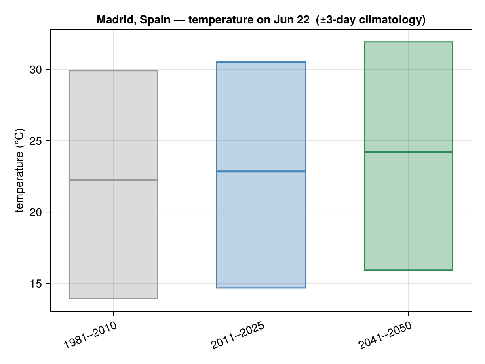
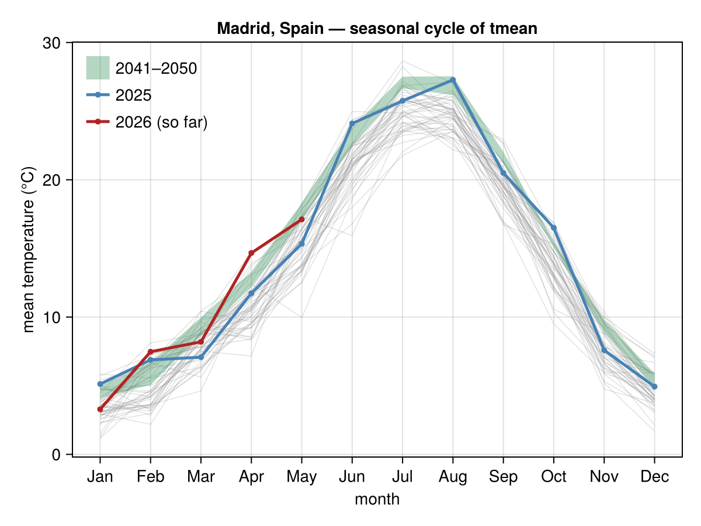
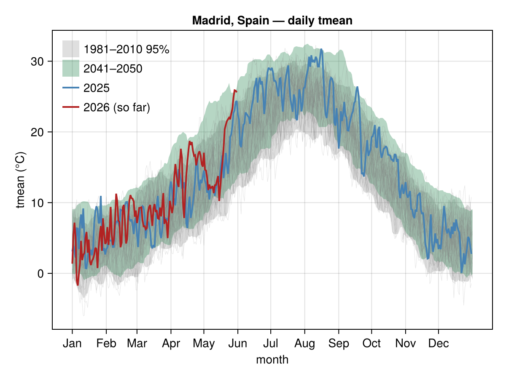

# Madrid, Spain

Temperature climatology for **Madrid, Spain**, from
[`climate_day_comparison`](@ref), [`climate_monthly`](@ref) and
[`climate_daily`](@ref). History is **NASA POWER** (1981→present); the future
band is a bias-corrected CMIP6 ensemble for 2041–2050. Madrid's series ship as a
committed offline fixture (see [Caching](../caching.md)).

```julia
using ClimStats, CairoMakie
save("madrid_daily.png", climate_daily("Madrid, Spain"; spaghetti = true))
```

These were rendered offline, so the day-of-year panel omits the live-forecast bar
(it appears when run online).






